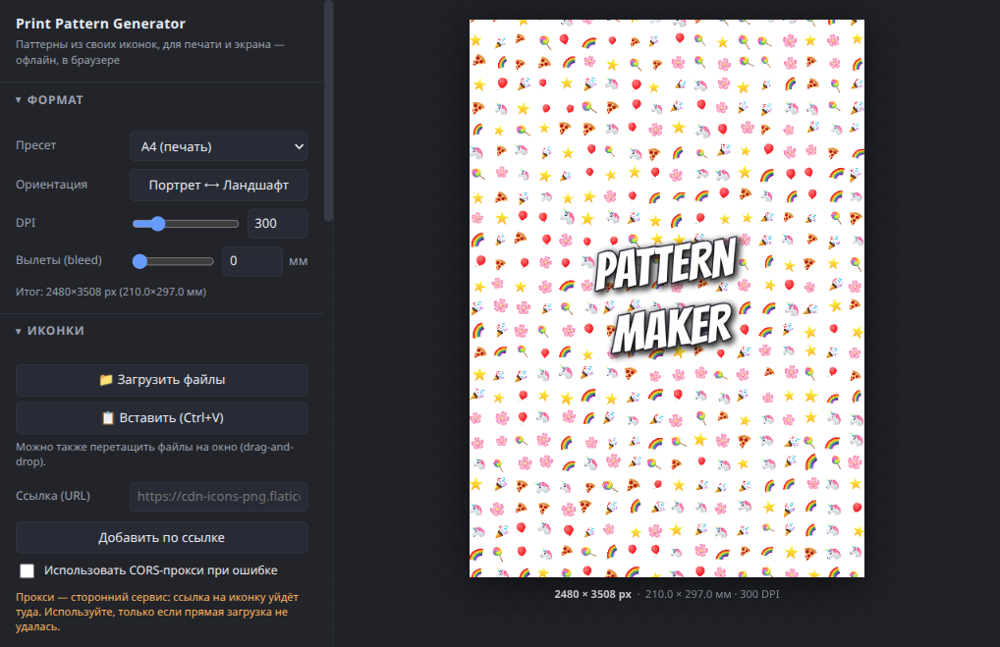

# Print Pattern Generator

*[Читать на русском](README.ru.md)*

A browser-based generator for seamless patterns made from **your own icons**
(SVG/PNG — e.g. picked from Flaticon — or emoji) — for print (A4, envelopes) and
screen (iPhone, desktop, social media). Runs entirely in the browser, no
backend, no build step: a single `index.html` file.

## Running it

Just open `index.html` in a browser — double-click it (`file://`) or serve it
through any static host / `python3 -m http.server`.

The only `file://` limitation: loading icons **by URL** can be blocked more
aggressively by the browser's security policy when running from a local file
than when served over http(s). If that gets in the way, open the page through
`python3 -m http.server` or deploy it to any static host (GitHub Pages, etc.).

## Features

- **Formats**: iPhone, Desktop (FHD/QHD), A4/A5 for print (with DPI and bleed
  for trimming), C6/DL envelopes, Instagram post/story, or a custom size in
  px or mm.
- **Icons**: file upload (drag-and-drop, paste from clipboard, file picker),
  adding by direct URL (e.g. from a Flaticon CDN link), an optional CORS
  proxy for problematic links, a built-in set of ~24 SVG icons, and an emoji
  fallback (for sketching — not recommended for print, since quality depends
  on the OS font).
- **Layout schemes**: grid, checkerboard, brick, random scatter, and a solid
  background fill + scatter on top. Position/size/opacity jitter, and icon
  cycling order (sequential / random / by row / by column).
- **Rotation**: per-icon rotation (fixed / alternating / random / incrementing
  per row, with optional angle snapping) and an independent rotation of the
  whole pattern.
- **Color**: recoloring SVG icons into a palette, background color/opacity,
  icon opacity.
- **Text overlay**: meme-generator-style text on top of the pattern — font,
  size, bold/italic, alignment, color, outline (color + width), shadow
  (color + blur + offset). The text block is draggable right in the preview:
  drag the text itself to move it, the handle above it to rotate, the corner
  handle to scale. The font list has a dedicated "🎪 Circus / carnival" group
  — Lobster, Lobster Two, Luckiest Guy, Bangers, Alfa Slab One, Rye, Bungee,
  Bungee Inline, Titan One, Chewy, Fredoka — loaded from Google Fonts
  (needs internet on first use; the rest of the page keeps working offline).
  **Note**: almost all of these bold poster fonts only cover Latin glyphs —
  non-Latin text will silently fall back to the generic font for that list
  entry (`cursive`/`serif`/`sans-serif`). For the full circus-poster effect,
  type your text in Latin script.
- **Export**: PNG, JPEG (with a quality setting), and **SVG** (vector, no
  quality loss when printed — icons are embedded as `<symbol>`/`<use>`,
  raster icons as `data:` URIs, text as real `<text>` with an outline and a
  shadow filter).
- **Persistence**: autosave to `localStorage` (including icons), JSON
  export/import of settings (with an option to embed icons as base64), a
  permalink carrying the full settings, and a "Reset everything" button that
  restores the defaults (with confirmation).

## Icons from Flaticon

1. On the icon's Flaticon page, grab a link to the PNG/SVG (usually available
   via "Copy link" at the size you want — something like
   `https://cdn-icons-png.flaticon.com/512/.../....png`).
2. Paste it into the "URL" field and click "Add from URL".
3. If the browser blocked the download over CORS, you'll get a clear message.
   In that case either download the icon file to disk and add it via
   "Upload files" (the most reliable option), or enable the "Use CORS proxy"
   checkbox (note: the icon URL is then sent to a third-party proxy service).

## Known limitations

- An icon loaded by URL under CORS restrictions can still block PNG/JPEG
  export (the canvas becomes "tainted"), even if it isn't flagged as such
  up front. In that case SVG export is still available — or remove the icon
  / use the proxy / upload it as a file instead.
- Recoloring arbitrary uploaded SVGs works through CSS `fill` inheritance:
  if the file's paths already hardcode a color (not `currentColor` and not
  empty), recoloring may not affect them. The built-in icon set always
  recolors correctly.
- With very large numbers of elements (dense scatter + a large format), the
  preview shows only a subset for responsiveness — the actual export always
  includes everything.
- Very high DPI on a large sheet can hit the browser's canvas size limit —
  the app will show a warning and suggest lowering the DPI/size.
